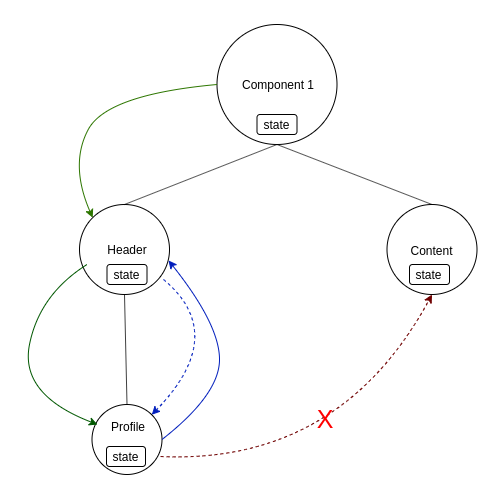
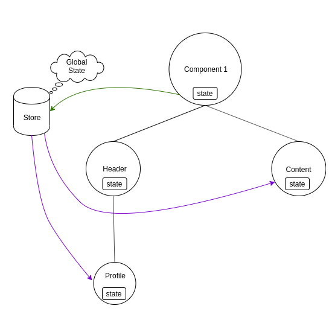
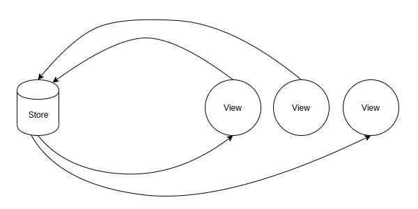

# Exemplificando o Redux e o Redux-Saga com um exemplo de SignIn e SignUp em NodeJS, ReactJS e ReactNative

Para a criação do projeto usou-se o [OmniCli](https://www.npmjs.com/package/@rocketseat/omni) da Rocketseat.

## Notas

1. O uso do redux para a autenticação, surge pelo fato de que vários componentes podem precisar de ter acesso aos dados do usuário autenticado. E esses diferentes componentes podem estar sendo exibidos simultaneamente;

2. **A parte principal do exemplo é usar a autenticação com redux e com saga, dando uma pequena luz de como esta biblioteca (que segue a arquitectura flux) funciona**;

3. O repositório está dividido em três partes: o [_backend_](./server) feito em Node; o [_frontend_](./web) feito em ReactJS e o [_mobile_](./mobile) com React-Native; e

4. Para cada projecto deve consultar o respectivo README em cada um deles e seguir as instruções para a instalação e inicialização.

# Motivação para o uso de uma Arquitectura Flux (mais propriamente o Redux)

Usando React, quer na web ou mobile, usa-se o sistema de componetização, ou seja, programamos as Views em forma de componentes, quer esteja exibindo apenas um, quer esteja exibindo diferentes componentes. Estes componentes organizam-se em uma estrutura de árvore como na figura abaixo.

Em cada componente do react temos o _state_ (privado ao componente, não sendo manipulável por outros componentes) onde colocamos os dados da aplicação, e quando queremos passar informação de um componente Pai para o Filho, passamos esse dado pelas _props_ (tanto da forma direta como usando rotas) que alimentam o _state_ com informações. Na imagem acima essa comunicação é retratada pelas linhas verdes.

Quando pretendemos passar infomações do Filho para o Pai (comunicar), usa-se uma _callback_, via _props_, do Pai para o Filho (linha azul tracejada), assim o componente Filho pode-se comunicar com componente Pai por meio dessa _callback_ (linha azul).

O que fica complicado é quando determinada alteração ou iteração do usuário em um determinado componente deveria comunicar tal situação a outros componentes que não estejam diretamente relacionados com este (linha tracejada vermelha). Ou quando, mesmo havendo relacionamento direto entre componentes, o número de componentes é maior do que 1, aumentando as chances de erro e dificultando a manutenção e a legibilidade do código.

## **Mas, e se pudessemos gerenciar um _state_ de forma global, capaz de receber e enviar informações (dados) independentemente do componente.**

O Redux cria fora dos componentes um espaço de armazenamento, chamado, normalmente, de _Store_. Ele é um objecto normal de javascript com um estado único. Capaz de armazenar os dados da aplicação e de notificar os componentes que usam esses dados, e, cada componente pode alterar o seu _state_ interno conforme o caso.

A comunicação entre a View (componente) e o Store não funciona de forma dual, mas sim em um sentido único, na verdade, em um sentido único, mas cíclico:

- Assim é possivel a View disparar as interações do usuário para a Store e, havendo alterações na Store, esta pode notificar específicas Views sobre esta mudança.
- Este entendimento de como a comunicção entre as Views e o Store funciona está representado de forma simples.

# **Redux**, biblioteca para gerenciamento de um State Global que assenta sobre a Arquitetura Flux

Seguindo a arquitetura Flux, podemos simplificar e dividir o Redux em quatro camadas (partes):

1. O Dispatcher (Reducers)
2. As Actions
3. O Store (no caso Redux - único e imutável)
4. As Views (Components)

## 1. Dispatcher

Existe apenas um por aplicação e é, basicamente, um gerente de registros de callbacks e de eventos. O **Disparcher** recebe **Actions** e realiza a cópia do store, suas alterações e a substituição do store anterior pelo novo **Store**.

## 2. Actions

São objectos com pelo menos uma propriedade chamada `type` e pode, ou não, ter mais propriedades com diferentes tipos de dados, normalmente, terá mais um com o nome de `payload`.
O `type` das Actions deve ser único por aplicação e ser o mais descritivo possível a fim de manter a legebilidade e entendimento de todo o fluxo de dados.

## 3. Store

É quem mantém os dados da aplicação. É único e imutável, todas as alterações ocorrem em uma cópia do state e este novo state com as alterações é quem substitui todo o state anterior. Não ocorre alterações no store, mas sim substituição do store anterior pelo novo. Também é responsável por notificar as mudanças ocorridas no estado dos dados ao seus subscritores (as **Views**, React Components)

## 4. Views

Recebe os dados para serem exibidos aos usuários e comunica **Actions** ao **Dispatcher** conforme a interação do usuário.

## (ainda em construção)

## A exemplificação sobre o redux e o saga encontra-se no [README.md do frontend](/web/README.md)
