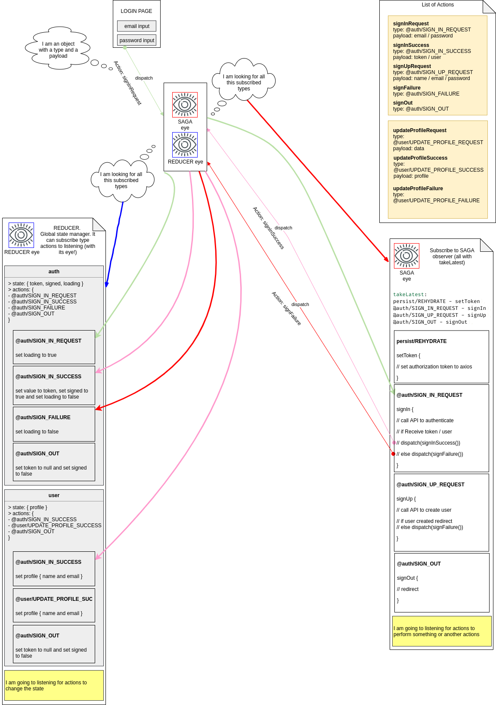

# _Frontend_ do exemplo de SignIn e SignUp em ReactJS e ReactNative com redux e saga

## Para o correto funcionamento a API da pasta server deve estar funcionando - [API](../server/README.md)

## Início

1. Instale as dependências com

```sh
yarn
```

2. Para iniciar

```sh
yarn start
```

## E o Saga

O redux-saga é uma biblioteca extra no funcionamento/uso do Redux. Ela serve como um _middleware_ para a realização de "tarefas" com _side-effetcs_. Performa "tarefas" assíncronas como CRUD, manipulação de arquivos... Possui total integração com o estado global da aplicação que é gerenciado pelo Redux e pode enviar **Actions** para o **Dispatcher**.
Veja mais em [redux-saga](https://github.com/redux-saga/redux-saga)

# Exemplo:

Para este caso em concreto o redux está sendo usando para manter o estado global da autenticação do usuário e dos dados do usuário.

- para a autenticação temos o dado `auth`; e
- para os dados do usuário o dado `user`.

(dividido em `auth` e `user` por motivos de consistência do tipo de dado que será armazenado em cada estrutura)

## auth

estruturado em:

- loading
- token
- signed

## user

estruturado em :

- profile

## Organização dos arquivos

Todo o tratamento do redux ficará dentro da pasta _store_ dentro da raiz do projeto. Dentro desta pasta temos outra pasta de nome _modules_, e, para cada dado a ser mantido pelo redux será criada uma pasta com o respectivo nome do dado (por motivo de legibilidade), no exemplo, duas pastas com o nome `auth` e `user`.

1. quanto aos arquivos dentro da pasta _store_ e da pasta _modules_, temos a seguinte síntese:

| Aquivo                   | resumo                                                                                                                                                                                                                                |
| :----------------------- | :------------------------------------------------------------------------------------------------------------------------------------------------------------------------------------------------------------------------------------ |
| ./index.js               | cria e exporta o _store_ propriamente dito de acordo com todos os _reducers_ criados em _modules_ e concentrados pelo _rootReducers_. Além de criar o _store_ com os _reducers_ adiciona o _saga_ como _middleware_ no fluxo de dados |
| ./persistReducer.js      | permite a persistência dos dados do _store_ por meio do pacote redux-persist                                                                                                                                                          |
| ./createStore.js         | por hora apenas aplica os _middlewares_ ao redux                                                                                                                                                                                      |
| ./modules/rootSaga.js    | concatena todos os _reducers_ de cada _module_                                                                                                                                                                                        |
| ./modules/rootReducer.js | concatena todos os _sagas_ de cada module                                                                                                                                                                                             |

2. para cada _module_ teremos três aquivos:

- `reducer.js` (contém o que será o _store_)
- `actions.js` (funções que ajudam a manter a consitência das **Actions**, em resumo cada função retornará sempre um objecto que contém, sempre, uma propriedade `type`, e poderá ou não possuir um `payload`)
- `sagas.js` (reponsável por criar as funções que atuarão quando determinada **Action** for disparada, podendo ou não contemplar ou executar alguma coisa ou disparar outras **Actions**)

## Descrevendo o fluxo por passos

<p align="center">

</p>
Imagem 1 (perdoem o desenho será melhorado!)

1. Na View de Login

   <p align="center">
   
   </p>

O usuário insere os dados nos inputs e ao clicar no botão Entrar a função handleSubmit será chamada e por sua vez executará a função dispatch com a Action que retornou do signInRequest.

```js
...

import { signInRequest } from '../../store/modules/auth/actions';

...

export default function SingIn() {
  const dispatch = useDispatch();

  function handleSubmit({ email, password }) {
    dispatch(signInRequest(email, password));
  }

  return (
    <>
      <span className="logo">LOGO</span>

      <Form schema={schema} onSubmit={handleSubmit}>
        <Input
          name="email"
          type="email"
          placeholder="E-mail" />
        <Input
          name="password"
          type="password"
          placeholder="Senha" />

        <button type="submit">Entrar</button>
        <Link to="/register">Criar conta</Link>
      </Form>
    </>
  );
}
```

isto é o dispatch que é o useDispatch é executado usando como argumento o objecto:

```json
{
  "type": "@auth/SIGN_IN_REQUEST",
  "payload": { email, password }
}
```

2 - O Dispatcher recebe a Action (linha verde 'dispatch' da imagem 1)

3 - Linha verde da imagem 1

3.1 - O saga que está observando por essa Action chama a função signIn. Esta função chama a API a fim de receber o token e os dados do usuário que se autentica. Após receber esses dados esta função envia para o Dispatcher a Action de signSuccess (linha rosa 'dispatch' da imagem 1)

```js
export function* signIn({ payload }) {
  try {
    const { email, password } = payload;

    const response = yield call(api.post, '/sessions', {
      email,
      password,
    });

    const { token, user } = response.data;

    api.defaults.headers.Authorization = `Bearer ${token}`;

    yield put(signInSuccess(token, user));

    history.push('/dashboard');
  } catch (error) {
    toast.error('Authentication fails');
    yield put(signFailure());
  }
}
```

- a função signInSuccess (as Actions são sempre um objecto) retorna:

```json
{
  "type": "@auth/SIGN_IN_SUCCESS",
  "payload": { token, user }
}
```

- esse objecto é enviado para o Dispatcher (linha rosa 'dispatch' da imagem 1) e continua no ponto 3

  2.2 - Ao "mesmo tempo" o Store (reducer de auth) que também está observando essa Action altera o estado de auth, mantém as mesmas propriedades do anterior e altera a propriedade loading para true

```js
// ...
const INITIAL_STATE = {
  token: null,
  signed: false,
  loading: false,
};

export default function auth(state = INITIAL_STATE, action) {
  return produce(state, draft => {
    switch (action.type) {
      case '@auth/SIGN_IN_REQUEST': {
        draft.loading = true;
        break;
      }
      // ...
    }
  });
}
```

3 - Na Action de signInSuccess, o Saga não tem essa subscrição e portanto nada faz. No entanto, os reducers de auth e de user sim. No primeiro, o Store altera o estado de auth alterando todas as suas propriedades (colocando o valor de token, signed para true e loading para false) e no user altera o valor de profile. Linhas rosas da imagem 1.

```js
// ...
const INITIAL_STATE = {
  token: null,
  signed: false,
  loading: false,
};

export default function auth(state = INITIAL_STATE, action) {
  return produce(state, draft => {
    switch (action.type) {
      // ...
      case '@auth/SIGN_IN_SUCCESS': {
        draft.token = action.payload.token;
        draft.signed = true;
        draft.loading = false;
        break;
      }
      // ...
    }
  });
}
```

Ficando o estado de auth completo e agora com os dados de autenticação do usuário.

```js
// ...
const INITIAL_STATE = {
  profile: null,
};

export default function user(state = INITIAL_STATE, action) {
  return produce(state, draft => {
    switch (action.type) {
      case '@auth/SIGN_IN_SUCCESS': {
        draft.profile = action.payload.user;
        break;
      }
      // ...
    }
  });
}
```

Ficando o estado de user completo e agora com os dados de profile do usuário.
